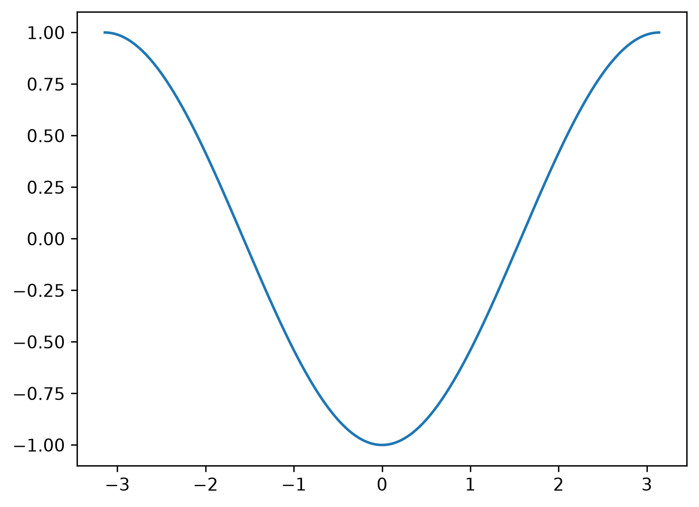
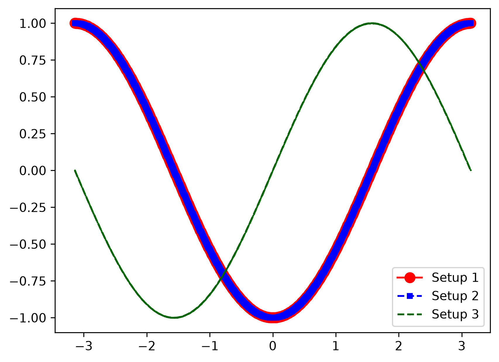

# PennylaneTutorial

Code written while following Xanadu's YouTube playlist:

**[PennyLane Tutorials - Playlist](https://www.youtube.com/playlist?list=PL_hJxz_HrXxsY23iiLZTxiPctXKYI6tNV)**

Each script is one small experiment. Its plot is saved under [`images/`](images/) with the same name.

| Script | Video | What it does |
|---|---|---|
| [`01_first_circuit.py`](01_first_circuit.py) | [2. My first quantum circuit in PennyLane](https://www.youtube.com/watch?v=2T8lSejPFog&list=PL_hJxz_HrXxsY23iiLZTxiPctXKYI6tNV&index=2) | First circuit: flip both qubits, rotate qubit 0 by θ, measure ⟨Z⟩ |
| [`01b_axis_sweep.py`](01b_axis_sweep.py) | Not in the tutorial | My own extension of video 2: the same circuit, generalised to choose the Pauli gate, rotation axis and measurement axis |

Run from the repo root, e.g. `python PennylaneTutorial/01_first_circuit.py`.

---

## 01: First circuit

Two qubits, both starting in |0⟩:

```
wire 0: |0⟩ ─────────⊕───── RY(θ) ── ⟨Z⟩
                     │
wire 1: |0⟩ ── X ────●─────────────────
```

1. **PauliX** on wire 1 flips it to |1⟩.
2. **CNOT** (control: wire 1, target: wire 0) flips wire 0 to |1⟩.
3. **RY(θ)** rotates wire 0 around the Y axis of the Bloch sphere.
4. The circuit returns the **expectation value ⟨Z⟩** of wire 0: +1 means |0⟩, −1 means |1⟩.

Sweeping θ from −π to π gives ⟨Z⟩ = −cos θ. At θ = 0 the qubit is still |1⟩ (−1), and at θ = ±π the rotation brings it back to |0⟩ (+1).



---

## 01b: Axis sweep

This experiment isn't in the tutorial. I wrote it to see how the result changes when the gates and measurement axis change.

`general_circuit()` picks which Pauli gate goes on wire 1 (X, Y or Z) and which rotation goes on wire 0 (RX, RY or RZ). It also works out the remaining third axis for the measurement. The plot overlays three setups:

| Setup | Pauli gate on wire 1 | Rotation on wire 0 | Measured | Curve |
|---|---|---|---|---|
| 1 | PauliX | RY | ⟨Z⟩ | −cos θ |
| 2 | PauliY | RX | ⟨Z⟩ | −cos θ |
| 3 | PauliZ | RY | ⟨X⟩ | sin θ |

Setups 1 and 2 overlap: both flip wire 0 to |1⟩, rotate it about an axis perpendicular to Z, then measure Z. In setup 3, PauliZ leaves |0⟩ unchanged, so the CNOT never fires and wire 0 starts from |0⟩.


