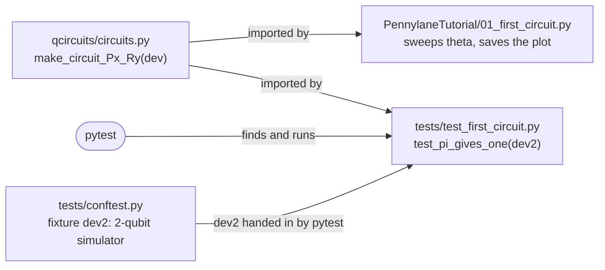

# QuantumPennylane

[](https://github.com/dtnnguyen/QuantumPennylane/actions/workflows/run-scripts.yml)

Learning quantum computing with [PennyLane](https://pennylane.ai), Xanadu's quantum programming library, alongside the [PennyLane Codebook](https://pennylane.ai/codebook) and Xanadu's YouTube playlists.

## Playlists

| Playlist | What it covers | Code |
|---|---|---|
| [PennyLane Tutorials - Playlist](https://www.youtube.com/playlist?list=PL_hJxz_HrXxsY23iiLZTxiPctXKYI6tNV) | Installing PennyLane, first circuits, devices, optimization, VQE, QAOA, Grover, the parameter-shift rule | [`PennylaneTutorial/`](PennylaneTutorial/) |
| [PennyLane Code Camp - Playlist](https://www.youtube.com/playlist?list=PL_hJxz_HrXxueNNX4CVerdIXVPle0JpAX) | Signing up, forming a team and a walkthrough of the Code Camp platform, plus the Munich, Sydney and Toronto meetups | — |
| [Xanadu Cloud Tutorials - Playlist](https://www.youtube.com/playlist?list=PL_hJxz_HrXxugF8aKVyk5t-j-58Aj9awp) | Running jobs on Xanadu's photonic hardware: Borealis and the X-series devices | — |

Install: `pip install -r requirements.txt` (Python 3.11). Jupyter notebook start-up steps: [`PennylaneJupyterNotebook.md`](PennylaneJupyterNotebook.md).

## Layout and running

```
qcircuits/            reusable circuits, imported by everything below
PennylaneTutorial/    one script per tutorial video
notebooks/            short notebooks that show results
tests/                pytest checks on the circuits
```

| Folder | What it is | How it's used |
|---|---|---|
| `PennylaneTutorial/` | Python files, one per tutorial | Run directly: `python PennylaneTutorial/01_first_circuit.py` |
| `qcircuits/` | Python code holding the circuits | Imported by the tutorial files and the tests: `from qcircuits.circuits import ...` |
| `tests/` | Python code that checks the circuits | Run by `pytest` |

Moving a circuit into `qcircuits/` is done by hand, one circuit at a time,
when it is worth reusing or testing. Until then a tutorial file can keep its
circuit inside it; both ways run the same.

From the repository root, with the environment active:

```bash
pytest                                   # run all tests
pytest tests/test_<topic>.py -v          # one file, one line per test
python PennylaneTutorial/<script>.py     # run a script
```

### Running the tests

Activate the environment and run pytest from the repository root, where
`pytest.ini` tells it to look in `tests/` and lets the tests import
`qcircuits`:

```bash
source <path-to>/xanadu_env/bin/activate    # your virtual environment
cd <path-to>/QuantumPennylane               # the repository root
pip install -r requirements.txt             # first time only: includes pytest
pip install -e .                            # first time only: makes qcircuits importable
pytest -v
```

pytest runs every function named `test_*` in every `tests/test_*.py` file and
prints PASSED, FAILED or SKIPPED for each. On a failure it shows the expected
value next to what the circuit returned.

| Command | Runs |
|---|---|
| `pytest` | all tests, one dot per test |
| `pytest -v` | all tests, one line per test |
| `pytest tests/test_<topic>.py` | one file |
| `pytest -k <word>` | only tests whose name contains `<word>` |
| `pytest -x` | stops at the first failure |

#### Example: the first circuit's test

`tests/test_first_circuit.py` checks `circuit_Px_Ry` from
`01_first_circuit.py`: at θ = π the circuit must return 1.0.

```bash
pytest tests/test_first_circuit.py -v
```

```
tests/test_first_circuit.py::test_pi_gives_one PASSED
```

How the pieces connect:



`test_pi_gives_one` never creates `dev2` itself. `dev2` is a pytest
**fixture** defined in `tests/conftest.py`: when a test function lists a
parameter with a fixture's name, pytest runs that fixture first and passes in
what it returns, a fresh 2-qubit simulator for every test. `conftest.py` is
loaded automatically for every test in `tests/`, so no import is needed.

To add tests, copy `tests/test_template.py` to `tests/test_<topic>.py` and
replace each `pytest.skip(...)` with a real check. Shared simulators (`dev1`,
`dev2`) and the comparison tolerance (`ATOL`) come from `tests/conftest.py`.

In VS Code, select the `xanadu_env` interpreter (Command Palette →
*Python: Select Interpreter*); the Testing panel (flask icon) then lists the
tests with a ▶ button for each. GitHub Actions runs the same `pytest -v` on
every push.

### Making a notebook from a script

The `.py` files are the source; a notebook is generated from one only when
needed (to share results with the plots showing) and is not kept in the repo.

```bash
jupytext --to notebook PennylaneTutorial/<script>.py          # writes <script>.ipynb next to it
jupyter nbconvert --to notebook --execute --inplace PennylaneTutorial/<script>.ipynb
                                                              # runs every cell, saves outputs into it
```

`jupytext` splits a script into cells wherever a line reads `# %%`, and a line
reading `# %% [markdown]` turns the comments below it into a text cell. Without
any markers it guesses, splitting at blank lines. The markers are ordinary
comments, so leave them in: `python <script>.py` ignores them, and VS Code shows
"Run Cell" above each one.

Keep a whole plot in one cell: from `plt.figure()` / the first `plt.plot` through
`plt.savefig` and `plt.show()`. Jupyter clears the figure at the end of every
cell, so a `savefig` in a later cell writes a blank image. Running the
notebook also overwrites the PNG in `images/`.

#### Bringing notebook edits back to the script

After fixing code in a notebook, write it back to the `.py`:

```bash
jupytext --to py:percent PennylaneTutorial/<script>.ipynb      # overwrites <script>.py with the notebook's code
```

Cell boundaries become `# %%` lines; outputs (plots, printed values) are not
copied. Use `py:percent`, not plain `py`, which can pick a different marker style.

To keep the two files in step without converting by hand, pair them once:

```bash
jupytext --set-formats ipynb,py:percent PennylaneTutorial/<script>.ipynb
                                                              # pair once: saving the notebook in Jupyter also updates the .py
jupytext --sync PennylaneTutorial/<script>.ipynb               # after editing the .py: copies the newer file over the older
```

Edit only one of the two at a time and convert (or sync) before switching:
whichever is converted last overwrites the other.

---

## Saving plots

To save a script's figure for its folder's README, call `savefig` before `plt.show()`:

```python
plt.legend()
plt.savefig(Path(__file__).parent / "images" / "<script-name>.png", dpi=300, bbox_inches="tight")
plt.show()   # after savefig: closing the window clears the figure
```
