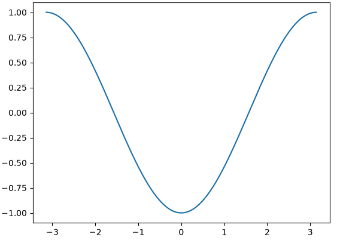
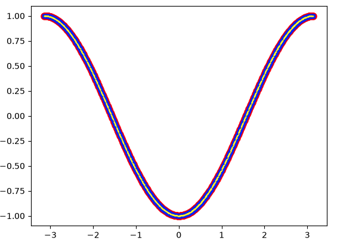

# QuantumPennylane

Learning quantum computing with [PennyLane](https://pennylane.ai), Xanadu's quantum programming library, alongside the [PennyLane Codebook](https://pennylane.ai/codebook).

Each script is one small experiment. Its plot is saved under [`images/`](images/) with the same name.

| Script | What it does |
|---|---|
| [`01_first_circuit.py`](01_first_circuit.py) | First circuit: flip both qubits, rotate qubit 0 by θ, measure ⟨Z⟩ |
| [`01b_axis_sweep.py`](01b_axis_sweep.py) | The same circuit, generalised to choose the Pauli gate, rotation axis and measurement axis |

Setup and the Jupyter notebook start-up steps: [`PennylaneJupyterNotebook.md`](PennylaneJupyterNotebook.md).

---

## 01: First circuit

Two qubits, both starting in |0⟩:

```
wire 0: |0⟩ ─────────⊕───── RY(θ) ── ⟨Z⟩
                     │
wire 1: |0⟩ ── X ────●─────────────────
```

1. **PauliX** on wire 1 flips it to |1⟩.
2. **CNOT** (control: wire 1, target: wire 0) flips wire 0 to |1⟩.
3. **RY(θ)** rotates wire 0 around the Y axis of the Bloch sphere.
4. The circuit returns the **expectation value ⟨Z⟩** of wire 0: +1 means |0⟩, −1 means |1⟩.

Sweeping θ from −π to π gives ⟨Z⟩ = −cos θ. At θ = 0 the qubit is still |1⟩ (−1), and at θ = ±π the rotation brings it back to |0⟩ (+1).



---

## 01b: Axis sweep

`general_ciruit()` picks which Pauli gate goes on wire 1 (X, Y or Z) and which rotation goes on wire 0 (RX, RY or RZ). It also works out the remaining third axis for the measurement. The plot overlays three setups:

| Setup | Pauli gate on wire 1 | Rotation on wire 0 |
|---|---|---|
| 1 | PauliX | RY |
| 2 | PauliY | RX |
| 3 | PauliZ | RY |



> **Known issue:** all three curves currently overlap because `general_ciruit()` passes fixed axis strings to the QNode instead of its arguments. Once it passes them through, the setups should differ. For example, PauliZ leaves |0⟩ unchanged, so setup 3 never flips wire 0.

---

## Saving plots

To save a script's figure for this README, call `savefig` before `plt.show()`:

```python
plt.legend()
plt.savefig("images/<script-name>.png", dpi=150, bbox_inches="tight")
plt.show()   # after savefig: closing the window clears the figure
```
